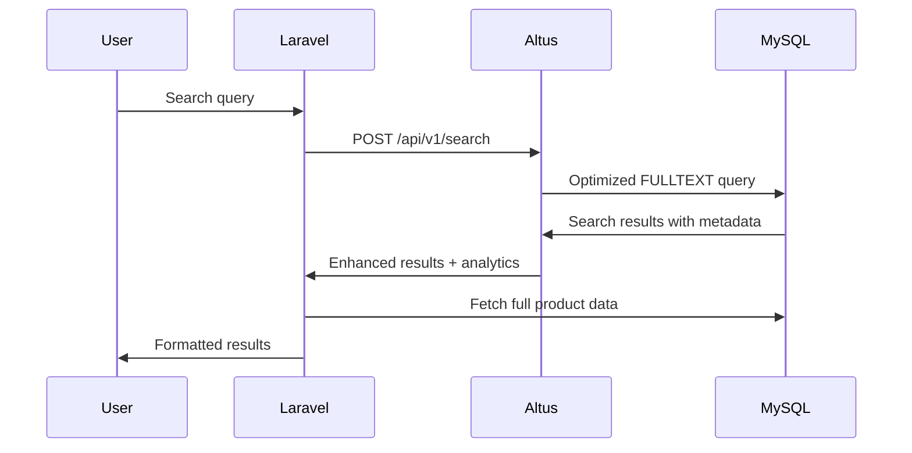

# Altus 4 Laravel Example Client

A complete Laravel application demonstrating how to integrate with the [Altus 4 API](https://github.com/altus4/core) for AI-enhanced MySQL full-text search. This example showcases practical implementation patterns, best practices, and real-world usage scenarios.

## Overview

This Laravel application demonstrates:
- **Product Search**: Full-text search across product catalogs using Altus 4's enhanced MySQL search
- **API Integration**: Clean service layer integration with the Altus 4 API
- **Modern Frontend**: Vue.js + Inertia.js + TypeScript for a responsive search interface
- **Search Analytics**: Integration with Altus 4's search analytics and trends
- **Performance Optimization**: Efficient data fetching and result processing

### Key Features

- **AI-Enhanced Search** - Semantic search with relevance scoring
- **Auto-complete** - Real-time search suggestions
- **Search Analytics** - Track search performance and trends
- **Result Highlighting** - Smart snippets and relevance indicators
- **Performance Optimized** - Efficient result processing and caching
- **Modern UI** - Clean, responsive interface with Tailwind CSS

## Architecture

### Backend Components

```
app/
├── Http/Controllers/
│   └── ProductController.php     # Main search controller
├── Models/
│   ├── Product.php              # Product model with search metadata
│   └── User.php                 # User authentication
└── Services/
    └── AltusService.php         # Altus API client service
```

### Frontend Components

```
resources/js/
├── pages/
│   └── Welcome.vue              # Main search interface
└── types/
    └── index.d.ts               # TypeScript definitions
```

### Database Schema

The application includes a products table optimized for full-text search:

```sql
-- Products table with FULLTEXT index
CREATE TABLE products (
    id BIGINT UNSIGNED PRIMARY KEY,
    name VARCHAR(255) NOT NULL,
    sku VARCHAR(255) UNIQUE,
    description TEXT,
    price DECIMAL(8,2) NOT NULL,
    stock INTEGER DEFAULT 0,
    weight DECIMAL(8,2),
    created_at TIMESTAMP,
    updated_at TIMESTAMP,

    FULLTEXT(name, description, sku)
    -- Optimized for Altus 4 search
);
```

## Prerequisites

- **PHP**: 8.2 or higher
- **Composer**: Latest stable version
- **Node.js**: 18.0 or higher
- **MySQL**: 8.0+ (with FULLTEXT search support)
- **Altus 4 API**: Running instance with API key

## Installation

### 1. Clone and Install Dependencies

```bash
# Clone the repository
git clone <your-repo-url>
cd altus4-laravel-example

# Install PHP dependencies
composer install

# Install Node.js dependencies
npm install
```

### 2. Environment Configuration

```bash
# Copy environment file
cp .env.example .env

# Generate application key
php artisan key:generate
```

### 3. Configure Environment Variables

Edit `.env` with your settings:

```bash
# Application
APP_NAME="Altus 4 Laravel Example"
APP_ENV=local
APP_DEBUG=true
APP_URL=http://localhost:8000

# Database
DB_CONNECTION=mysql
DB_HOST=127.0.0.1
DB_PORT=3306
DB_DATABASE=altus4_example
DB_USERNAME=your_db_user
DB_PASSWORD=your_db_password

# Altus 4 API Configuration
ALTUS_BASE_URL=http://localhost:3000/api/v1
ALTUS_API_KEY=your_altus_api_key
ALTUS_DATABASE_ID=your_database_id
```

### 4. Database Setup

```bash
# Create database
mysql -u root -p -e "CREATE DATABASE altus4_example"

# Run migrations
php artisan migrate

# Seed with sample data
php artisan db:seed
```

### 5. Altus 4 API Setup

Make sure your Altus 4 API is running and configured:

```bash
# In your Altus 4 API directory
npm run dev
```

Add your Laravel app's database to Altus 4:

```bash
# Register your database with Altus 4 API
curl -X POST http://localhost:3000/api/v1/databases \
  -H "Authorization: Bearer YOUR_ALTUS_API_KEY" \
  -H "Content-Type: application/json" \
  -d '{
    "name": "Laravel Example Products",
    "host": "127.0.0.1",
    "port": 3306,
    "database": "altus4_example",
    "username": "your_db_user",
    "password": "your_db_password"
  }'
```

### 6. Build and Start

```bash
# Build frontend assets
npm run build

# Start Laravel development server
php artisan serve

# Or use the dev script for concurrent processes
composer run dev
```

The application will be available at `http://localhost:8000`

## Configuration

### Altus 4 Service Configuration

The `AltusService` class handles all API interactions. Configure it in `config/services.php`:

```php
// config/services.php
return [
    'altus' => [
        'base_url' => env('ALTUS_BASE_URL', 'http://localhost:3000/api/v1'),
        'api_key' => env('ALTUS_API_KEY'),
        'timeout' => env('ALTUS_TIMEOUT', 30),
        'retry_attempts' => env('ALTUS_RETRY_ATTEMPTS', 3),
    ],
];
```

### Search Configuration

Customize search behavior by modifying the ProductController:

```php
// In ProductController::index()
$response = $altus->search([
    'query' => $query,
    'databases' => [env('ALTUS_DATABASE_ID')], // Your database ID
    'tables' => ['products'],                  // Tables to search
    'columns' => ['name', 'description', 'sku'], // Searchable columns
    'searchMode' => 'natural',                 // natural, boolean, semantic
    'limit' => 50,                            // Results per page
    'includeAnalytics' => true,               // Include search analytics
]);
```

## Usage Examples

### Basic Product Search

```php
// In a controller
use App\Services\AltusService;

public function search(Request $request, AltusService $altus)
{
    $results = $altus->search([
        'query' => $request->input('q'),
        'databases' => ['your-database-id'],
        'searchMode' => 'natural',
        'limit' => 20
    ]);

    return response()->json($results);
}
```

### Search Suggestions

```php
// Get auto-complete suggestions
$suggestions = $altus->suggestions(
    query: 'laptop',
    databases: ['your-database-id'],
    limit: 5
);
```

### Search Analytics

```php
// Get search trends
$trends = $altus->trends();

// Get search history
$history = $altus->history(limit: 50, offset: 0);

// Analyze query performance
$analysis = $altus->analyze([
    'query' => 'gaming laptop',
    'databases' => ['your-database-id']
]);
```

## Code Structure

### ProductController

The main controller demonstrates:
- Search query handling
- Result processing and ordering
- Metadata attachment from Altus search results
- Error handling for API failures

Key methods:
- `index()` - Main search endpoint
- `extractSkus()` - Extract product identifiers from search results
- `fetchProductsBySkus()` - Efficiently fetch products maintaining search order
- `attachAltusMeta()` - Attach Altus metadata (relevance scores, snippets)

### AltusService

A clean service layer providing:
- HTTP client configuration
- Error handling and logging
- Response processing
- Multiple search methods (search, suggestions, analysis, trends)

### Frontend Integration

The Vue.js frontend (`Welcome.vue`) showcases:
- Real-time search form
- Responsive product grid
- Search result highlighting
- Loading states and error handling

## API Integration Patterns

### 1. Search Flow



### 2. Error Handling

The service implements comprehensive error handling:

```php
protected function request(string $method, string $path, array $body = []): ?array
{
    try {
        $response = Http::withHeaders([
            'Authorization' => "Bearer {$apiKey}",
            'Accept' => 'application/json',
        ])->timeout(30)->post($base . $path, $body);

        if ($response->successful()) {
            return $response->json();
        }

        // Log and handle non-success responses
        logger()->warning('AltusService: non-success response', [
            'status' => $response->status(),
            'body' => $response->body()
        ]);

        return null;
    } catch (Exception $e) {
        logger()->error('AltusService request failed: ' . $e->getMessage());
        return null;
    }
}
```

### 3. Result Processing

Efficient processing maintains search result ordering:

```php
private function fetchProductsBySkus(array $skus)
{
    // Fetch products and key by SKU
    $fetched = Product::whereIn('sku', $skus)->get()->keyBy('sku');

    // Return in original search order
    return collect($skus)
        ->map(fn ($sku) => $fetched->get($sku))
        ->filter();
}
```

## Performance Optimization

### Database Optimization

```sql
-- Ensure proper FULLTEXT indexing
ALTER TABLE products ADD FULLTEXT(name, description, sku);

-- Index frequently searched columns
CREATE INDEX idx_products_price ON products(price);
CREATE INDEX idx_products_stock ON products(stock);
```

### Laravel Optimization

```php
// Use database connection pooling
// In config/database.php
'mysql' => [
    'options' => [
        PDO::ATTR_PERSISTENT => true,
    ],
],

// Cache frequent searches
$results = Cache::remember("search:{$query}", 300, function() use ($altus, $query) {
    return $altus->search(['query' => $query]);
});
```

## Testing

### Running Tests

```bash
# Run all tests
php artisan test

# Run specific test classes
php artisan test --filter=ProductControllerTest
php artisan test --filter=AltusServiceTest
```

### Test Examples

```php
// tests/Feature/SearchTest.php
public function test_product_search_returns_results()
{
    // Create test products
    $products = Product::factory()->count(10)->create();

    // Mock Altus API response
    Http::fake([
        'localhost:3000/api/v1/search' => Http::response([
            'success' => true,
            'data' => ['results' => [/* mock results */]]
        ])
    ]);

    // Test search endpoint
    $response = $this->get('/?q=laptop');

    $response->assertStatus(200);
    $response->assertInertia(fn ($page) =>
        $page->component('Welcome')
             ->has('products')
    );
}
```

## Troubleshooting

### Common Issues

1. **"Missing Altus configuration"**
   - Ensure `ALTUS_BASE_URL` and `ALTUS_API_KEY` are set in `.env`
   - Verify the Altus 4 API is running

2. **"No search results"**
   - Check that your database is registered with Altus 4
   - Verify FULLTEXT indexes exist on searchable columns
   - Ensure the database ID matches your Altus configuration

3. **"Frontend not loading"**
   - Run `npm run build` to compile assets
   - Check that Node.js dependencies are installed

4. **"Database connection failed"**
   - Verify MySQL is running and accessible
   - Check database credentials in `.env`
   - Ensure the database exists

### Debug Mode

Enable verbose logging for troubleshooting:

```bash
# In .env
LOG_LEVEL=debug
ALTUS_DEBUG=true
```

### Health Checks

Verify your setup:

```bash
# Check Altus API connectivity
curl -H "Authorization: Bearer YOUR_API_KEY" \
     http://localhost:3000/health

# Test database connection
php artisan tinker
>>> DB::connection()->getPdo();

# Verify products exist
>>> App\Models\Product::count();
```

## Deployment

### Production Checklist

- [ ] Set `APP_ENV=production` in `.env`
- [ ] Configure proper database credentials
- [ ] Set up SSL certificates
- [ ] Enable caching with Redis
- [ ] Configure queue workers for background tasks
- [ ] Set up monitoring and logging
- [ ] Optimize Composer autoloader: `composer install --optimize-autoloader --no-dev`
- [ ] Build production assets: `npm run build`

### Docker Deployment

```dockerfile
FROM php:8.2-fpm

# Install dependencies
RUN apt-get update && apt-get install -y \
    git curl zip unzip \
    && docker-php-ext-install pdo pdo_mysql

# Copy application
COPY . /var/www/html
WORKDIR /var/www/html

# Install dependencies
RUN composer install --optimize-autoloader --no-dev
RUN npm ci && npm run build

CMD ["php-fpm"]
```

## Contributing

1. Fork the repository
2. Create a feature branch: `git checkout -b feature/your-feature`
3. Make your changes with proper tests
4. Run the test suite: `php artisan test`
5. Commit your changes: `git commit -am 'Add feature'`
6. Push to the branch: `git push origin feature/your-feature`
7. Create a Pull Request

## License

This example application is open-sourced software licensed under the [MIT license](LICENSE).

## Support

- **Altus 4 API Documentation**: [Core API Docs](https://github.com/altus4/core)
- **Laravel Documentation**: [Laravel Docs](https://laravel.com/docs)
- **Issue Tracker**: [GitHub Issues](https://github.com/your-repo/issues)

---

**Built with Laravel, Vue.js, and the Altus 4 API**